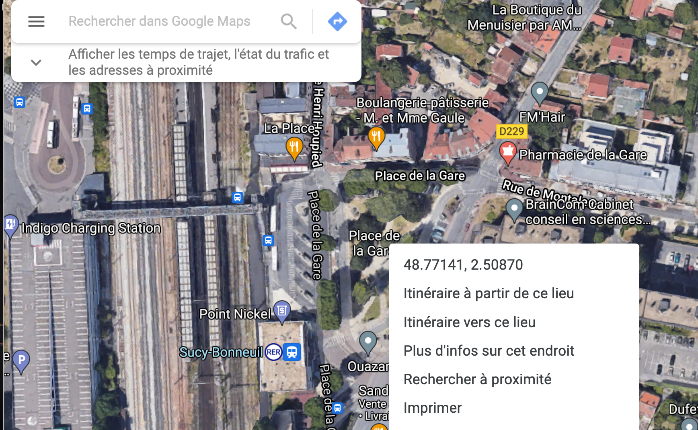

# Cartographie dynamique avec leaflet {#c33-CARTO-dynamik}

```{r  echo=TRUE, cache=FALSE, warning=FALSE}
library(knitr)
## Global options
options(max.print="80")
opts_chunk$set(echo=TRUE,
               cache=FALSE,
               prompt=FALSE,
               tidy=FALSE,
               comment=NA,
               message=FALSE,
               warning=FALSE,
               options(scipen=999))
opts_knit$set(width=75)

# Packages utilitaires
library(dplyr)
library(rmdformats)

# Packages graphiques
library(ggplot2)
library(RColorBrewer)

#packages cartographiques 
library(sf)
library(leaflet)
library(htmlwidgets)
library(htmltools)

```


## Premiers pas

<p style="border:0.5px; border-style:solid; border-color:navajowhite3; padding: 1em; font-size:15px">
**OBJECTIFS** : Ce premier cours propose de fournir les bases élémentaires du logiciel Leaflet. Il est très largement inspiré d'un article d'Elena Salette publié sur l'excellent site de formation ThinkR et intitulé [Cartographie interactive : comment visualiser mes données spatiales de manière dynamique avec leaflet ?](https://thinkr.fr/cartographie-interactive-comment-visualiser-mes-donnees-spatiales-de-maniere-dynamique-avec-leaflet/) 
</p>

<p style="border:0.5px; border-style:solid; border-color:navajowhite3; padding: 1em; font-size:15px">
**BUG WARNING** : Il peut arriver que la transformation du fichier .Rmd en .html ne s'opère pas et que vous voyiez apparaître le message d'erreur suivant **RMarkdown cannot knit: html_dependency not found**. Ce message d'erreur persiste même après avoir corrigé le code... ce qui est très pénible. Après avoir cherché sur les forums de discussion, j'ai trouvé une première réponse [sur stackoverflow](https://stackoverflow.com/questions/53750383/rmarkdown-error-path-for-html-dependency-not-found) qui consiste simplement à aller sur **la flèche descendnate à droite du bouton knitr** et effectuer un **clear knitr cache** avant de relancer le Knitr. Apparemment ça marche, sans que je sache bien pourquoi. Mais la solution la plus efficace semble être d'insérer une option **cache=FALSE** dans les options globales du fichier Markdown. Cela va sans doute un peu ralentir l'affichage des pages HTML,mais évite les problèmes. On pourra toujours rétablir **cache=TRUE** si nécessaire
</p>


Notre objectif très limité sera de construire une carte interactive utilisant le fonds de carte OpenStreetMap que l'on pourra zoomer en avant ou en arrière. La carte comportera la localisation de la place de la gare à Sucy-en-Brie avec une "épingle" de localisation comportant une photographie de la gare et un petit texte de promotion de celle-ci. 

### Lancement avec `leaflet()`

Nous allons avoir besoin des packages suivants :

- `leaflet` puisque c'est l'objet même du cours !
- `dplyr` afin de pouvoir construire des programmes utilisant des pipes `%>%`
- `sf` pour charger des fonds de carte de différents types (points, lignes polygones)
- `htmltools` et `htmlwidgets` pour ajouter des popups interactifs sur notre carte

Pour vérifier que le package leaflet est bien installé, nous créons une première carte (vide !)

```{r}
map <- leaflet()

map
```

Et il n'y a ... RIEN ! si ce n'est un bouton de zoom


### Remplissage avec `addTiles()`

On ajoute sur ce fond de carte vide des "tuiles" cartographiques qui sont des images se modifiant selon l'échelle pour apporter plus ou moins de détails. Par défaut, le fonds de carte de référence est le fonds `OpenStreetMap`

```{r}
library(leaflet)

map <- leaflet() %>%
          addTiles()

map
```
La carte est désormais interactive et on peut effectuer des zooms ou se déplacer.


### Calage avec `setView()`

Nous allons ensuite choisir un point de référence, par exemple la place de la gare à Sucy-en-Brie. Pour trouver les coordonnées de latitude et longitude, la solution la plus simple est d'utiliser [Google Maps](https://www.google.fr/maps) puis de zoomer sur la zone d'étude et enfin d'**effectuer un click droit avec la souris sur le point dont on cherche les coordonnées** pour obtenir dans un popup les coordonnées recherchées : 


On peut alors procéder à une double opération de **centrage** de notre carte et de définition d'une **échelle d'observation** afin que la carte produite par `leaflet`couvre bien la zone qui nous intéresse. Cette double opération est réalisée à l'aide de la fonction `setView()` assortie des trois paramètre suivants :

- `lng =` pour la longitude
- `lat =` pour la latitude
- `zoom =` pour le degré d'aggrandissement de la carte de 1 pour le Monde entier à 20 pour une vision ulra locale


```{r}
map <- leaflet() %>% 
          addTiles() %>%
          setView(lat = 48.77141, lng=2.50870, zoom = 17)

map
```

Une fois qu'on a vérifié le centrage avec un zoom fort (ici 17), on peut refaire la carte en utilisant un zoom plus faible, par exemple un zoom de 12 permettant de visualiser toute la commune de Sucy et les communes voisines.

```{r}
map <- leaflet() %>% 
          addTiles() %>%
          setView(lat = 48.77141, lng=2.50870, zoom = 12)

map
```

### Personalisation avec  `addProviderTiles()`

Les tuiles OpenStreetMap qui servent de fonds de carte par défaut peuvent être remplacés par des tuiles personalisées fournies par des producteurs publics ou privés. On peut obtenir la liste des tuiles disponibles en tapant `providers` dans la console de R studio et les tester une par une. Mais il est souvent plus simple et plus rapide d'aller visualiser les tuiles disponibles sur [ce site web](http://leaflet-extras.github.io/leaflet-providers/preview/) où l'on peut centrer le monde sur sa zone d'étude et voir ce que donnent les différentes familles de tuiles. 

A titre d'exemple, les tuiles `Stamen.Watercolor` donnent une touche pastel artistique à la carte :


```{r}
map <- leaflet() %>% 
            addProviderTiles('Stamen.Watercolor') %>%
          setView(lat = 48.77141, lng=2.50870, zoom = 12)

map

```

Tandis que la couche `Esri.WorldTopoMap` fournit une imagerie précise mais de couleurs plus neutre que les tuiles `OpenStreetMap` , ce qui sera intéressant si on superspose des marqueurs de couleur vive. 


```{r}
map <- leaflet() %>% 
            addProviderTiles('Esri.WorldTopoMap') %>%
          setView(lat = 48.77141, lng=2.50870, zoom = 12)
map

```


### Affichage d'un point avec `addMarkers()`

L'usage le plus fréquent de `leaflet`consiste à ajouter des éléments de localisation ponctuelle appelés `markers`et de rendre ces objets ponctuels interactifs avec l'ouverture de fenêtres `popups`lorsqu'on clique dessus avec la souris. On va donc voir pas à pas comment construire de telles cartes interactives en partant du cas le plus simple (marqueur unique) pour aller vers les cas plus complexes (ensemble de marqueurs de taille, couleur et formes différentes).

Nous allons commencer par indiquer l'emplacement de la place de la gare de Sucy-en-Brie sur notre carte précédente à l'aide de la fonction `addMarkers()` : 

```{r}
map <- leaflet() %>% 
            addProviderTiles('Esri.WorldTopoMap') %>%
            setView(lat = 48.77141, lng=2.50870, zoom = 12) %>% 
            addMarkers(lat = 48.77141, lng=2.50870)
map
```
On constate que le marqueur donne bien la position choisi mais n'est pas interactif. Il faut ajouter plus de paramètres pour assurer l'interactivité. 

### Ajout d'un `label`ou d'un `popup`

On peut définir deux comportements d'un marker selon que la souris ne fait que passer dessus (`label`) ou selon que l'utilisateur effectue un click sur marker et déclenche l'ouverture d'une fenêtre (`popup`). Dans sa version la plus simple, l'interactivité consiste à ajouter une chaîne de caractère à ces deux paramètres. 

```{r}
icone_gare <-makeIcon(iconUrl = "img/gare_sucy_coord_googlemap.png")
map <- leaflet() %>% 
            addProviderTiles('Esri.WorldTopoMap') %>%
            setView(lat = 48.77141, lng=2.50870, zoom = 12) %>% 
            addMarkers(lat = 48.77141, lng=2.50870,
                      # En passant la souris
                      label = "GARE DE SUCY-BONNEUIL", 
                      # En cliquant sur l'icone
                       popup = "La gare RER A de Sucy Bonneuil est bien reliée aux communes 
                                 environnantes par un réseau de bus partant dans toutes les directions")
map
```


### Amélioration du `popup`

Mais on peut faire beaucoup mieux, notamment pour la fenêtre `popup`qui peut prendre la forme d'une mini-page web dont on fixe le contenu en html avec la fonction `paste0()` et les dimensions avec le sous-paramètre `popupOptions()`. 


```{r}


# Préparation de la fenêtre Popup
    my_popup = paste0(
      "<b> LA GARE DE SUCY",
      "</b><br/><br/>",
      "La gare RER A de Sucy Bonneuil est bien reliée aux communes 
                                 environnantes par un réseau de bus partant dans toutes les directions.")


  
# Réalisation de la carte
map <- leaflet() %>% 
            addProviderTiles('Esri.WorldTopoMap') %>%
            setView(lat = 48.77141, lng=2.50870, zoom = 12) %>% 
            addMarkers(lat = 48.77141, lng=2.50870,
                      # En passant la souris
                      label = "GARE DE SUCY-BONNEUIL", 
                      # En cliquant sur l'icone
                       popup = my_popup, 
                      # Quelques options de la popup
                        popupOptions = 
                      list(maxHeight = 150, maxWidth = 200))
map

```


### Prolongements

Et voila, le tour est joué. Il faut maintenant réfléchir à la façon de construire une carte comportant un ensemble d'épingles similaires avec des couleurs ou des formes différentes, des messages différents, des photographies variées ... Il ne sera alors évidemment pas possible d'ajouter une commande addMarkers() pour chaque épingle si la carte en comporte des centaines. 

Si vous avez bien compris ce cours, vous pourrez trouver des réponses en lisant de façon autonome le reste de l'article dont nous nous somme inspiré : [Cartographie interactive : comment visualiser mes données spatiales de manière dynamique avec leaflet ?](https://thinkr.fr/cartographie-interactive-comment-visualiser-mes-donnees-spatiales-de-maniere-dynamique-avec-leaflet/) 

## Cartographie de points


Nous allons prendre comme exemple la cartographie des logements sociaux tels qu'ils sont recensés par l'état dans le RPLS (Répertoire Permanent des Logements Sociaux). Pour plus de détails sur l'acquisition des données, on pourra se reporter au documnt suivant :https://claudegrasland.github.io/logement/


### Préparation des données

On charge le fichier des logements sociaux du Val de Marne en 2019

```{r}
logt<-readRDS("carto/logt/RPLS2020.RDS")
head(logt)
```

Le fichier logt comporte 177902 lignes, chacune correspondant à un logement. On le transforme en fichier d'adresse en fusionnant les logements et on agrège quelques informations sur les logements situés à la même adresse

```{r}
adr<-logt %>% group_by(Commune = LIBCOM, Adresse = result_label, latitude, longitude) %>% 
              summarise(nblogt = n(),
                        ancien = min(CONSTRUCT),
                        surfmoy = mean(SURFHAB),
                        piecmoy = mean(NBPIECE)) 
   
head(adr)
```

Le fichier adresse ne comporte plus que 11908 lignes correspondant aux adresses où se trouvent des logement sociaux. Ceux-ci étant le plus souvent nombreux à la même adresse dès lors qu'il s'agit de tours ou de barres. 

On va prendre comme exemple les logements sociaux de trois communes voisines : Sucy-en-Brie, Bonneuil-sur-Marne et Ormesson-sur-Marne

```{r}
sel<-adr %>% filter(Commune %in% c("Sucy-en-Brie","Bonneuil-sur-Marne","Ormesson-sur-Marne"))
```


### Cartographie des localisations

On commence par créer une carte des localisations des logements sociaux avec AddCircleMarkers()


```{r}

  
# Réalisation de la carte
map <- leaflet() %>% 
            addProviderTiles('Esri.WorldTopoMap') %>%
            setView(lat = 48.77, lng=2.53, zoom = 13) %>%
  
             addCircleMarkers(data=sel,
                              lat = ~latitude,
                              lng = ~longitude)

map
```


### Réglage de la taille des cercles

On règle la taille des cercles en fonction du nombre de logements


```{r}
# Calcul du diamètre des cercles
  sel$myradius <-5+15*sqrt(sel$nblogt/max(sel$nblogt,na.rm=T)) # Taille minimale de 5 et maximum  de 20 pixels
  
# Réalisation de la carte
map <- leaflet() %>% 
            addProviderTiles('Esri.WorldTopoMap') %>%
            setView(lat = 48.77, lng=2.53, zoom = 13) %>%
  
             addCircleMarkers(data=sel,
                              lat = ~latitude,
                              lng = ~longitude,
                              radius= ~myradius,    # diamètre
                              stroke=FALSE,         # pas de bordure           
                              fillOpacity = 0.5)    # opacité 
            
                              

map
```

### Réglage de la couleur des cercles 

On fait varier la couleur des cercles en fonction de l'ancienneté des logements


```{r}
# Calcul du diamètre des cercles
  sel$myradius <-5+15*sqrt(sel$nblogt/max(sel$nblogt,na.rm=T)) # Taille minimale de 5 et maximum  de 20 pixels

# Choix des classes 
    mycut<-c(1900, 1950,1960,1970,1980,1990,2000, 2010,2020)
    
# Choix de la palette (c'est une fonction !)
   mypal <- colorBin('Spectral', 
                       sel$ancien,
                       bins=mycut)
  
# Réalisation de la carte
map <- leaflet() %>% 
            addProviderTiles('Esri.WorldTopoMap') %>%
            setView(lat = 48.77, lng=2.53, zoom = 13) %>%
  
             addCircleMarkers(data=sel,
                              lat = ~latitude,
                              lng = ~longitude,
                              
                              radius= ~myradius,    # diamètre
                              
                              stroke=TRUE,          # bordure   
                              weight=1  ,           # épaisseur de la bordure
                              color= "black",      # couleur de la bordure
                              opacity = 0.7  ,       # opacité de la bordure 
                              
                              fillOpacity = 0.5,    # opacité 
                              fillColor = ~mypal(ancien)
                              )    %>%
              addLegend(data = sel,
                      pal = mypal, 
                      title = "Ancienneté",
                      values =~ancien, 
                      position = 'topright') 
            
                              

map
```


### Ajout d'un popup d'information

On rajoute un popup et au passage on change les tuiles. 


```{r}
# Calcul du diamètre des cercles
  sel$myradius <-5+15*sqrt(sel$nblogt/max(sel$nblogt,na.rm=T)) # Taille minimale de 5 et maximum  de 20 pixels

# Choix des classes 
    mycut<-c(1900, 1950,1960,1970,1980,1990,2000, 2010,2020)
    
# Choix de la palette (c'est une fonction !)
   mypal <- colorBin('Spectral', 
                       sel$ancien,
                       bins=mycut)
   
   
 # Préparation des popups
      mypopups <- lapply(seq(nrow(sel)), function(i) {
      paste0(  paste("Adresse              : " ,sel$Adresse[i]), '<br>', 
               paste("Nb. de logements     : " ,sel$nblogt[i]), '<br>', 
               paste("Ancienneté           : ", sel$ancien[i]), '<br>',
               paste("Surface moyenne (m2) : " ,round(sel$surfmoy[i],1)), '<br>',                
               paste("Nb moyen de pièces   :", round(sel$piecmoy[i],2))
            ) 
            })
      mypopups<-lapply(mypopups, htmltools::HTML)  

   
  
# Réalisation de la carte
map <- leaflet() %>% 
           addProviderTiles('Esri.WorldTopoMap') %>%
            setView(lat = 48.77, lng=2.53, zoom = 13) %>%
             addCircleMarkers(data=sel,
                              lat = ~latitude,
                              lng = ~longitude,
                              
                              radius= ~myradius,    # diamètre
                              
                              stroke=TRUE,          # bordure   
                              weight=1  ,           # épaisseur de la bordure
                              color= "black",      # couleur de la bordure
                              opacity = 0.7  ,       # opacité de la bordure 
                              
                              fillOpacity = 0.5,    # opacité 
                              fillColor = ~mypal(ancien),
                              
                             popup = mypopups,
                              )    %>%
              addLegend(data = sel,
                      pal = mypal, 
                      title = "Ancienneté",
                      values =~ancien, 
                      position = 'topright') 
            
                              

map
```

### Choix des tuiles

```{r}
# Calcul du diamètre des cercles
  sel$myradius <-5+15*sqrt(sel$nblogt/max(sel$nblogt,na.rm=T)) # Taille minimale de 5 et maximum  de 20 pixels

# Choix des classes 
    mycut<-c(1900, 1950,1960,1970,1980,1990,2000, 2010,2020)
    
# Choix de la palette (c'est une fonction !)
   mypal <- colorBin('Spectral', 
                       sel$ancien,
                       bins=mycut)
   
   
 # Préparation des popups
      mypopups <- lapply(seq(nrow(sel)), function(i) {
      paste0(  paste("Adresse              : " ,sel$Adresse[i]), '<br>', 
               paste("Nb. de logements     : " ,sel$nblogt[i]), '<br>', 
               paste("Ancienneté           : ", sel$ancien[i]), '<br>',
               paste("Surface moyenne (m2) : " ,round(sel$surfmoy[i],1)), '<br>',                
               paste("Nb moyen de pièces   :", round(sel$piecmoy[i],2))
            ) 
            })
      mypopups<-lapply(mypopups, htmltools::HTML)  
   
   
  
# Réalisation de la carte
map <- leaflet() %>% 
               # Tuiles
               addTiles(group = "OSM ") %>%
               addProviderTiles('Esri.WorldTopoMap', group = "ESRI topo.") %>%
               addProviderTiles('Esri.WorldImagery', group = "ESRI photo.") %>%
              # Contrôle des tuiles
               addLayersControl( baseGroups = c("OSM","ESRI topo.","ESRI photo."),
                                 position = "bottomright") %>%

  
            setView(lat = 48.77, lng=2.53, zoom = 13) %>%
  
             addCircleMarkers(data=sel,
                              lat = ~latitude,
                              lng = ~longitude,
                              
                              radius= ~myradius,    # diamètre
                              
                              stroke=TRUE,          # bordure   
                              weight=1  ,           # épaisseur de la bordure
                              color= "black",      # couleur de la bordure
                              opacity = 0.7  ,       # opacité de la bordure 
                              
                              fillOpacity = 0.5,    # opacité 
                              fillColor = ~mypal(ancien),
                              
                             popup = mypopups,
                              )    %>%
  
              addLegend(data = sel,
                      pal = mypal, 
                      title = "Ancienneté",
                      values =~ancien, 
                      position = 'topright') 
            
                              

map
```


## Carte de polygones

### Chargement d'un fichier sf

On prend comme exemple les données relatives au nombres de ménages en HLM dans le  Val de Marne à l'échelle des IRIS. 
`

```{r}
map<-readRDS("carto/logt/map_iris_hlm.RDS") # Fichier
class(map) # vérifie que le format est bien sf
mapiris <- map %>% mutate(MEN_TOT = round(TOT,0),
                          MEN_HLM = round(HLM1,0),
                          HLM_pct=round(HLMpct,1),) %>%
                   select(IRIS,NOM_COM,NOM_IRIS,MEN_TOT,MEN_HLM, HLM_pct)             
head(mapiris)

```

### Projection en WGS 84

Les coordonnées géométriques sont actuellement projetées selon la projection `(crs = RF93_Lambert_93` qui est la projection de référence utilisée en France. Cette projection permet de calculer au mieux les distances avec une précision de l'ordre du mètre. 

Mais les données ainsi projetées ne sont pas utilisables par `leaflet`qui attend des coordonnées de latitude et longitude non projetées . On doit donc reprojeter le fond de carte pour le rendre utilisable par Leaflet et ajouter des colonnes lat et lng. Cela se fait facilement avec la fonction `st_transform()`du package sf en lui donnant comme paramètre `(crs=4326)` ce qui correspond à la projection WGS 84. 


```{r}
mapiris<-mapiris  %>% st_transform(crs = 4326)
head(mapiris)
```

### ajout des centroides de polygones

Le fichier est en apparence le même mais les coordonnées de la variable *geometry* sont désormais en degrés décimaux. Et on peut du coup extraire pour chaque polygone les coordonnées du point central à l'aide des fonctions `st_centroid()` et `st_coordinates()`


```{r}
coo<-st_coordinates(st_centroid(mapiris))
head(coo)
```

On ajoute ces deux variables de coordonnées dans notre fichier principal pour pouvoir les combiner avec les autres variables 

```{r}
mapiris$lng<-coo[,1]
mapiris$lat<-coo[,2]
```

### Création d'une carte des communes

si nous de disposons pas déjà d'une carte de communes, on peut la réaliser facilement en agrégeant les données IRIS par la variable NOM_COM puis ajouter les centroïdes de ces dernières comme on l'a fait pour les IRIS.

```{r}
mapcom <- map %>% group_by(NOM_COM) %>% summarise() %>% st_as_sf() %>%st_transform(crs=4326)
coo<-st_coordinates(st_centroid(mapcom))
mapcom$lng<-coo[,1]
mapcom$lat<-coo[,2]
```
Un message nous avertit qu'il aurait mieux valu calculer les centroïdes sur des données projetées mais ce n'est pas absolument indispensable si l'on ne cherche pas une précision absolue. 


### Affichage avec `addPolygons()`

La fonction leaflet de base pour tracer des polygones est `addPolygons()`  qui est l'équivalent de `addMarkers()` que l'on a vu précédemment. Mais la différence importante est que l'on peut désormais fournir un fichier sf aux fonctions `addPolygons` et `addMarkers` puis accéder aux variables contenues dans ce fichier en utilisant un tilde '~'suivi du nom de la variable.  


On peut par exemple construire une carte des communes avec un label donnant le nom

```{r}
# Réalisation de la carte
map <- leaflet() %>% 
            addProviderTiles('Esri.WorldTopoMap') %>%
            setView(lat = 48.77, lng=2.53, zoom = 12) %>% 
            addPolygons(data = mapcom,
                        color = c("red","orange","yellow","green","blue"),
                        label = ~NOM_COM)
map
```
On peut superposer plusieurs cartes de polygones à condition que certaines soient composée uniquement de lignes de contour (`fill = `) dont on peut régler l'épaisseur (`weight= `) ou la couleur (`color =`). Les labels ou popup ne pourront a priori concerner également qu'une seule couche. 

```{r}

# Ajout de la variable couleur
mapiris$comcolor<-as.factor(mapiris$NOM_COM)
levels(mapiris$comcolor)<-rainbow(50)


# Réalisation de la carte
map <- leaflet() %>% 
            addProviderTiles('Esri.WorldTopoMap') %>%
            setView(lat = 48.77, lng=2.53, zoom = 12) %>% 
            addPolygons(data = mapiris,
                        fill = TRUE,
                        color = ~comcolor,
                        label = ~NOM_IRIS,
                        weight = 1) %>%
            addPolygons(data = mapcom,
                        fill = FALSE,
                        color = "black",
                        weight = 2)
map
```


### Cartes choroplèthes avec` colorBin()`


De la même manière que nous avons affiché la couleur des communes  dans chaque IRIS, nous pouvons proposer une carte choroplèthe du % de personnes habitant dans des HLM et ajouter un popup donnant la valeur de l'indicateur si l'on clique. La seule difficulté est de préparer une palette de couleur à l'aide de l'une des fonction `colorNumeric()`, `colorBin()`, `colorQuantile()` ou `colorFactor()`. 

Voyons un exemple sur la variable pct_1 qui est le % de logements sociaux. Supposons que l'on veuille examiner la part des logements sociaux qui sont très supérieurs ou très inférieurs à 20% en prenant des classes qui suivent une progression géométrique : 

```{r}
# Choix de la variable
   myvar <-mapiris$HLM_pct
# Choix des classes 
    mycut<-c(0, 5, 10, 20,40,100)
# Choix de la palette (c'est une fonction !)
   mypal <- colorBin('RdYlBu', 
                       myvar,
                       bins=mycut)


# Réalisation de la carte
map <- leaflet() %>% 
            addProviderTiles('Esri.WorldTopoMap') %>%
            setView(lat = 48.77, lng=2.53, zoom = 12) %>% 
            addPolygons(data = mapiris,
                        fillColor = ~mypal(HLM_pct),
                        fillOpacity = 0.5,
                        color = "white",
                        label = ~HLM_pct,
 #                       popup = mypop,
                        weight = 1) %>%
            addLegend(data = mapiris,
                      pal = mypal, 
                      title = "% ménages en HLM",
                      values =~HLM_pct, 
                      position = 'topright') %>%
            addPolygons(data = mapcom,
                        fill = FALSE,
                        color = "black",
                        weight = 2)
map
```


### Cartes de stock avec `addCircleMarkers()`

Notre carte est intéressante mais elle ne permet pas de voir quelle est la population concernée par le logement social. En effet, certains IRIS sont très étendus alors qu'ils regroupent peu de population et d'autres sont très petits mais comporte beaucoup de logements sociaux. Ce qui est logique puisque les HLM sont le plus souvent des immeubles à plusieurs étages.

Nous allons donc superposer sur la carte précédente le nombre de personnes vivant en logement social. Puisqu'il s'agit d'un stock, nous devrons utiliser un figuré ponctuel avec une surface proportionnelle au nombre de ménages  en HLM.


```{r}
# Choix de la variable
   myvar <-mapiris$HLM_pct
# Choix des classes 
    mycut<-c(0, 5, 10, 20,40,100)
# Choix de la palette (c'est une fonction !)
   mypal <- colorBin('RdYlBu', 
                       myvar,
                       bins=mycut)
  
   
# Calcul du diamètre des cercles
   myradius <-8*sqrt(mapiris$MEN_HLM/max(mapiris$MEN_HLM, na.rm=T))


# Réalisation de la carte
map <- leaflet() %>% 
            addProviderTiles('Esri.WorldTopoMap') %>%
            setView(lat = 48.77, lng=2.53, zoom = 12) %>% 
            addPolygons(data = mapiris,
                        fillColor = ~mypal(HLM_pct),
                        fillOpacity = 0.5,
                        color = "white",
                        label = ~HLM_pct,
 #                       popup = mypop,
                        weight = 1) %>%
            addLegend(data = mapiris,
                      pal = mypal, 
                      title = "% ménages en HLM",
                      values =~HLM_pct, 
                      position = 'topright') %>%
             addCircleMarkers(data=mapiris,
                              lat = ~lat,
                              lng = ~lng,
                              radius = myradius,
                              stroke = FALSE,
                              label = ~MEN_HLM,
                              fillColor = "gray50",
                              fillOpacity = 0.5)%>%
            addPolygons(data = mapcom,
                        fill = FALSE,
                        color = "black",
                        weight = 2)
map
```

### La cerise sur le gâteau ...

Et pour terminer notre belle carte, nous allons ajouter une fenêtre popup apportant à l'utilisateur tous les renseignements sur chaque IRIS. Pour cela nous allons devoir construire chaque fenêtre popup au format HTML préalablement à l'affichage des cartes en utilisant des outils issus sdes packaghes `htmltools`et `htmlwidgets`. On supprime les labels des deux couches, l'utilisateur ayant désormais juste à cliquer sur un Iris pour obtenir tous les renseignements dans une seule fenêtre


```{r}
# Choix de la variable
   myvar <-mapiris$HLM_pct
# Choix des classes 
    mycut<-c(0, 5, 10, 20,40,100)
# Choix de la palette (c'est une fonction !)
   mypal <- colorBin('RdYlBu', 
                       myvar,
                       bins=mycut)
  
   
# Calcul du diamètre des cercles
   myradius <-8*sqrt(mapiris$MEN_HLM/max(mapiris$MEN_HLM,na.rm=T))
   
# Préparation des popups
      mypopups <- lapply(seq(nrow(mapiris)), function(i) {
      paste0(  paste("Commune               : ",mapiris$NOM_COM[i]), '<br>',
               paste("Iris                  : " ,mapiris$NOM_IRIS[i]), '<br>', 
               paste("Nb. de ménages        : " ,mapiris$MEN_TOT[i]), '<br>', 
               paste("Nb. de ménages en HLM : " ,mapiris$MEN_HLM[i]), '<br>',                
               paste("% ménages . en HLM    :", mapiris$HLM_pct[i])
            ) 
            })
      mypopups<-lapply(mypopups, htmltools::HTML)


# Réalisation de la carte
map <- leaflet() %>% 
            addProviderTiles('Esri.WorldTopoMap') %>%
            setView(lat = 48.77, lng=2.53, zoom = 13) %>% 
            addPolygons(data = mapiris,
                        fillColor = ~mypal(HLM_pct),
                        fillOpacity = 0.5,
                        color = "white",
                        popup = mypopups,
                        weight = 1,
                        highlightOptions = highlightOptions(weight = 3, color = 'green')) %>%
            addLegend(data = mapiris,
                      pal = mypal, 
                      title = "% ménages en HLM",
                      values =~HLM_pct, 
                      position = 'topright') %>%
             addCircleMarkers(data=mapiris,
                              lat = ~lat,
                              lng = ~lng,
                              radius = myradius,
                              stroke = FALSE,
                              fillColor = "gray50",
                              fillOpacity = 0.5)%>%
            addPolygons(data = mapcom,
                        fill = FALSE,
                        color = "black",
                        weight = 2)
map
```
